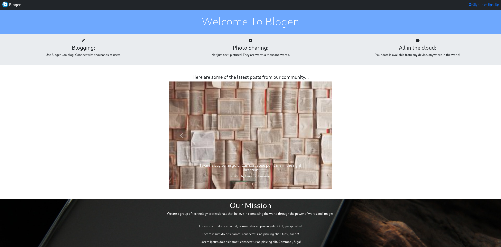
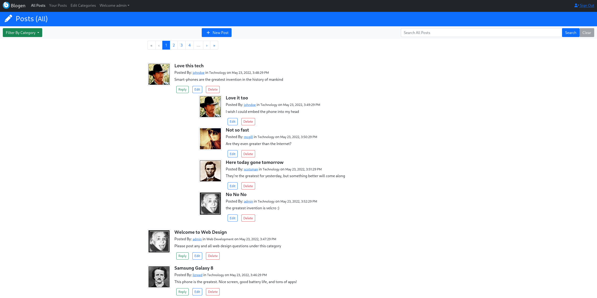
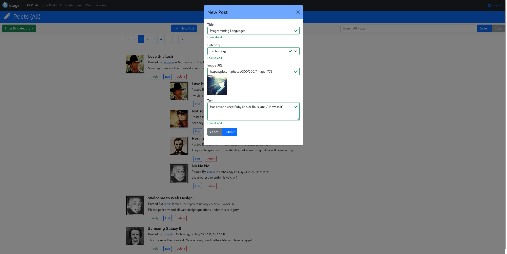

AWS-Blogen-Vue
======================================================================================================

AWS-Blogen-Vue is another iteration of my fictitious website called "Blogen". Blogen is described
in more detail ["here"](https://github.com/strohs/springboot-blogen). In short, Blogen is a simple message board
that allows users to start threaded discussions on different topics. It's a fullstack web application that I use to
learn different technologies.

This version of Blogen uses Vue.js for the frontend web pages, Spring Boot for the REST Api,  
and incorporates AWS Cognito (for user management) along with AWS DynamoDB (to store user messages).


More specifically, it uses the following technologies:
- On the frontend
    - Vue.js (Vue3)
    - Bootstrap 5
    - Vuelidate (for form validations)
    - Vite (as the bundler)
    - Axios (to make calls to the Blogen REST Api)
    - AWS Javascript SDK
    - [AWS Amplify](https://docs.amplify.aws/) (to interact with AWS Cognito)
    - [AWS Amplify UI](https://ui.docs.amplify.aws/?platform=vue) (for custom Vue components that enable user sign-in, sign-up)
- On the backend
  - AWS
    - Cognito (for user management, authentication and authorization)
    - DynamoDB (to store the messages created by users)

  - Spring Boot
    - serves a custom REST API and integrates with DynamoDB
    - Spring Security (to authenticate access to the REST Api using JSON Web Tokens issued by Cognito)
    - [Spring Data DynamoDB](https://derjust.github.io/spring-data-dynamodb/) (to use Spring Data with DynamoDB)
    - AWS Java SDK (to access DynamoDB)



<br/>



<br/>




    
## Building and Running

### Prerequisites
You should be familiar with and have the following technologies installed on your machine:
- Node.js (at least version 14) and npm
- Java at least version 8 up to 11 (version 11 was used during development)
- Spring Boot
- Apache Maven (at least version 3)


- Familiarity with AWS: web console, IAM
- AWS cli. You must have the aws cli installed and [configured](https://docs.aws.amazon.com/cli/latest/userguide/cli-configure-quickstart.html)
locally on your machine with an access key and secret access key.
During development, I used a IAM user with the "AdministratorAccess" policy, which grants full access to AWS resources and services.
These access keys are needed by Spring Boot in order to bootstrap a Cognito User Pool, Identity Pool and five dummy users.
There shouldn't be any charges incurred if you are a new Cognito user as this amount of users is well below their free-tier limit. 
Nonetheless, Cognito pricing is described [here](https://aws.amazon.com/cognito/pricing/).
DynamoDB will also be bootstrapped with dummy data, but when running the project using the `dynmodb-local` profile, the local server version of
DynamoDB is used rather than the cloud version. See the [Building](#building) section below for info on the different Spring Boot profiles 


### Building
1. build the project
    - from a terminal, make sure your in the project base directory, `aws-blogen-vue`, and run:
    > mvn clean install

2. start the spring boot embedded server using the `dev` AND `dynamodb-local` profiles:
    > mvn spring-boot:run -Dspring-boot.run.profiles=dev,dynamodb-local -pl backend

This will start the spring boot on port 8080. The `dev` and `dynamodb-local` profiles will perform the following actions:
    - The `dev` profile will bootstrap a Congito User Pool, Identity Pool, and an application client. As well as create 5 sample users within the user pool.
    - The `dev` profile will also create the "Blogen" table and bootstrap it with some sample messages for each user.
    - The `dynamodb-local` profile will start a locally running instance of dynamodb. NOTE: If you omit this profile, then the `dev` profile will create 
    the table within the REAL (i.e. cloud) version of DynamoDB (assuming your AWS user has permission to use DynamoDB)
    - The code that performs the bootstrapping is located [here](./backend/src/main/java/com/cliff/aws/blogen/bootstrap)

3. Check the spring boot console to verify that the cognito resources where configured correctly. Search for lines that begin with the string 
"COGNITO". You will need to find the following four ID's:
```
COGNITO REGION us-east-1
COGNITO USER POOL ID: us-east-1_SOME_USER_POOL_ID
COGNITO IDENTITY POOL ID: us-east-1:SOME_IDENTITIY_POOL_ID
COGNITO APPLICATION CLIENT ID: SOME_APP_CLIENT_ID
```
If these IDs are missing, or `null`, then the bootstrap process failed. Either your aws credentials are missing or they do not have the correct
permissions to create the required resources.

4. Configure the frontend to use the cognito resources
    - copy the four Cognito IDs into the frontend's [.env.local file](./frontend-vue/.env.local), you must set these properties:
      ```
      VITE_AWS_REGION=us-east-1
      VITE_AWS_USER_POOL_ID=user_pool_id_here
      VITE_AWS_IDENTITY_POOL_ID=identity_pool_id_here
      VITE_AWS_USER_POOL_WEB_CLIENT_ID=application_client_id_here
      ```

5. in a separate terminal, cd into the `frontend-vue` directory and start the frontend dev server (it will run on port 3000 by default)
    > npm run dev

6. Open your web-browser to:  `http://localhost:3000`
7. login using one of the bootstrapped users. Try either `admin@example.com` or `lizreed@example.com` with a password of "Password".
8. try creating new posts or navigating the site using the top nav bar.
9. When you are finished, stop the spring boot server, using CTRL-C. This will cleanup all Bootstrapped resources that where created.


## Blogen Project Directory Structure
- **backend** directory - contains the Spring Boot backend code. Spring Boot is used to serve the Blogen REST API 
that performs the CRUD operations on the Blogen table within DynamoDB. 
Spring Security has been configured to validate the JWT Tokens issued by cognito. These tokens are sent with each request 
to the REST API.
- **frontend-vue** directory - contains all the Vue.js code for the Blogen frontend
- **lambdas** directory - contains and example AWS lambda function that performs a "Post Confirmation Trigger". This would be used
in a production environement to perform user maintenance on each new user that signs-up with Blogen. This lambda is
not used when running the project locally, in "dev" mode.
- **aws** directory - this directory contains example CloudFormation templates that could be used to create the Cognito and DynamoDB
resources required by Blogen.
- **native-libs** - this folder contains the sql-lite (.dlls and .so) required by dynamodb-local. If this directory is missing, dynamodb-local
will not start.
- **.mvn** - contains the maven wrapper .jar used by `mvnw` (Linux/MacOS) and `mvnw.cmd` (Windows) commands. Maven wrapper is a
local version of Apache Maven for users that don't have maven installed on their machines. 


## AWS-Blogen-Vue High Level Architecture

### Vue.JS and Bootstrap5
Blogen's view layer uses Vue.js and is styled with Bootstrap 5. 
It uses the [AWS Amplify API](https://aws-amplify.github.io/) to interact with AWS Cognito.
The [Axios](https://axios-http.com/) library is used to retrieve user threads and posts from the Blogen REST API.
  
### AWS Cognito
Amazon Cognito provides user sign-up, sign-in, and access control. It provides "user pools" to store user information and
"identity pools" to grant users access to some AWS resources.

#### Blogen Cognito User Pool
- A Cognito *User Pool* is used to store user registration details. The pool has been configured to allow users
to sign into Blogen using their email address.
- The user pool also stores the following user attributes:
    * first-name
    * last-name
    * password
    * preferred-username (e.g. the user's handle)
    * *avatar image name* - a custom attribute that stores the avatar image filename that a user has chosen for themselves

#### Blogen Cognito Identity Pool
A Cognito identity pool is used to federate authenticated and unauthenticated users with AWS and give them 
temporary access to AWS resources. An identity pool is being used because Blogen users need access to some Cognito 
API Calls, specifically the *ListUsers* API so that the web application can query the user pool in order to find out which preferred-usernames 
and email addresses have been taken.

### Spring Boot
Spring Boot 2 is used as the application server. It performs four roles:
- serves the Blogen REST API
- makes API calls to DynamoDB to retrieve data
- validates JSON Web Tokens (JWT) passed to the REST API
  - specifically, the api requires that authenticated clients send the *ID-Tokens* issued by Cognito with each request to the REST Api

### DynamoDB
Blogen stores all data used by the website (other than user details) in a single DynamoDB table. It primarily stores
the threads and posts created by users, which consist of the following attributes:
- threadID, postID, post-title, post-text, image-url, userID, category-name

The Blogen table also stores other "types" of items as explained below..

#### Blogen DynamoDB Primary Key Structure(s)
The Blogen DynamoDB table uses a composite primary key (range + hash) to store various items. There are four "types" of items 
being stored in a single table. Each of these items use a different primary key structure. 
The structure of the primary key for each item type is as follows:

* thread start item - stores the first "post" of a thread. Its primary key structure is as follows:
    * hash key - a UUID String (named `THREAD-UUID` see below)
    * range key - a composite string that starts with the string literal "POST_" + `TIMESTAMP` + `THREAD-UUID`
        * note: in the range key, the hash key's uuid is contained as part of the range key so that the first post
         in a thread can be found in queries
* post item - a "child" post of a thread. Its primary key structure is as follows:
    * hash key - a child posts hash key will equal its starting thread UUID (`THREAD-UUID`)
    * range key - a child posts range key is a composite string that starts with the string literal "POST_" + `TIMESTAMP` + `UUID`
        * `TIMESTAMP` is a ISO 8601 date time string of the form *2018-10-18T19:02:41.627Z*
        * `UUID` is a UUID string 
* category name item - stores the name of a category that posts can belong to, i.e. "Technology","Business"...
    * hash key - a string containing the category name
    * range key - will always equal the constant string "CATEGORY"
* avatar file name item - the name of an avatar file stored on the Blogen app server, i.e. "avatar1.jpg"
    * hash key - a String containing the actual avatar file name
    * range key - will always equal the constant string "AVATAR" 

| item type stored      | Hash Key (*partition key*) | Range Key (*sort key*)         | Attribute1 | Attribute2 | Attribute3     | Attribute4 | Attribute5 | Attribute6         | Attribute7    | Attribute8  | Attribute9 |
|-----------------------|----------------------------|--------------------------------|------------|------------|----------------|------------|------------|--------------------|---------------|-------------|------------|
| thread start item     | `THREAD-UUID`              | POST_`TIMESTAMP`_`THREAD-UUID` | *title*    | *text*     | *categoryName* | *imageUrl* | *userID*   | *updatedTimestamp* | `THREAD-UUID` | `POST-UUID` |
| post item             | `THREAD-UUID`              | POST_`TIMESTAMP`_`POST_UUID`   | *title*    | *text*     | *categoryName* | *imageUrl* | *userID*   | *updatedTimestamp* | `THREAD-UUID` | `POST-UUID` |
| category name item    | *categoryName*             | **CATEGORY**                   | 
| avatar file name item | *avatarFileName*           | **AVATAR**                     |


| Global Secondary Indices Name | GSI Hash Key   | GSI Range Key  | Notes                                                                                                                             |
|-------------------------------|----------------|----------------|-----------------------------------------------------------------------------------------------------------------------------------|
| categoryNameIndex             | *categoryName* | *primaryRange* | this GSI is used to query posts by category name                                                                                  |
| userIdIndex                   | *userId*       | *primaryRange* | this GSI is used to find all posts made by a specific user                                                                        |
| rangeIndex                    | *primaryRange* | *primaryHash*  | this GSI is used in a number of queries: to get recently posted threads (by timestamp) and to get a list of all avatar file names |

